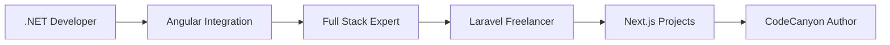

<div align="center">
  
# 🚀 Welcome to Hardik Kanajariya's Code Universe! 


[](https://github.com/hardikkanajariya)
[](https://github.com/hardikkanajariya)

</div>

---

## 🎭 About Me

```javascript
const hardikKanajariya = {
    name: "Hardik Kanajariya",
    role: "Full Stack Developer",
    currentJob: {
        company: "Kale Logistics",
        stack: [".NET Web API", "Angular"],
        position: "Software Developer"
    },
    
    freelanceWork: {
        technologies: ["Laravel", "Next.js"],
        focus: "Web Applications & Custom Solutions"
    },
    
    sideProjects: {
        platform: "CodeCanyon",
        profile: "hkdevlopers",
        speciality: "Web Scripts & Templates"
    },
    
    location: "India 🇮🇳",
    
    currentlyLearning: [
        "Advanced .NET Core features",
        "Angular latest updates",
        "Laravel best practices",
        "Next.js 14 features"
    ],
    
    philosophy: "Clean code, efficient solutions, and continuous learning!",
    
    funFact: "I debug .NET by day and build Laravel magic by night! 🌙",
    
    getInTouch: function() {
        return {
            email: "hardikkanajariya@yahoo.com",
            codecanyon: "hkdevlopers",
            github: "hardikkanajariya"
        };
    }
};
```

<div align="center">

## 🛠️ Tech Stack & Tools

### 💼 Professional Work Stack


### 🚀 Freelance & Side Projects


### 🎨 Frontend Technologies


### 🗄️ Databases & Tools


</div>

---

<div align="center">

## 📊 GitHub Analytics


</div>

<div align="center">

## 🔥 GitHub Streak


</div>

---

## 🎯 Current Focus Areas

<table>
<tr>
<td width="50%">

### 💼 Day Job @ Kale Logistics
- **Enterprise .NET Web APIs**
- **Angular Frontend Development**
- **Database Design & Optimization**
- **API Integration & Management**
- **Business Logic Implementation**

</td>
<td width="50%">

### 🌙 Freelance Projects
- **Laravel Web Applications**
- **Next.js Modern Frontends**
- **Custom Business Solutions**
- **E-commerce Development**
- **API Development & Integration**

</td>
</tr>
</table>

---

<div align="center">

## 💰 CodeCanyon Marketplace

### 🏪 HKDevlopers Store


**🌟 Specializations:**
- Laravel Web Scripts
- PHP Applications
- Custom Web Solutions
- Database-driven Applications
- Modern Web Templates

[](https://codecanyon.net/user/hkdevlopers)

</div>

---

## 📈 Professional Journey



---

<div align="center">

## 🛠️ Current Tech Stack

### 🏢 Professional Stack (Kale Logistics)
```
Backend:  .NET Core Web API + C#
Frontend: Angular + TypeScript
Database: SQL Server
Tools:    Visual Studio, Git, Azure DevOps
```

### 💻 Freelance Stack
```
Backend:  Laravel + PHP / Next.js API Routes
Frontend: Next.js + React / Laravel Blade
Database: MySQL / PostgreSQL
Tools:    VS Code, Composer, npm/yarn
```

</div>

---

## 📈 Contribution Graph


---

<div align="center">

## 🌐 Connect With Me

<a href="mailto:hardikkanajariya@yahoo.com">
  
</a>
<a href="https://codecanyon.net/user/hkdevlopers">
  
</a>
<a href="https://github.com/hardikkanajariya">
  
</a>

### 💼 Open for Freelance Projects!


**Laravel • Next.js • Custom Web Solutions**

</div>

---

<div align="center">

## 🎭 Developer Life

<details>
<summary>🎯 My Coding Philosophy!</summary>

```
🏢 .NET by Day, Laravel by Night
⚡ Performance > Pretty Code
🔧 Right Tool for the Right Job
📚 Never Stop Learning
☕ Coffee.exe is always running
```

</details>

<details>
<summary>📊 Fun Developer Stats</summary>

```
📅 Coding Since: Several years now
🏢 Professional: .NET Web APIs + Angular
🌙 Freelance: Laravel + Next.js
☕ Coffee Dependency: Critical Level
🐛 Bugs Squashed: Countless
💡 Solutions Built: Many satisfied clients
```

</details>

</div>

---

<div align="center">

### 💝 Support My Work

If you find my open source contributions helpful! ⭐

[](https://www.buymeacoffee.com/hardikkanajariya)

---


**"Code is like humor. When you have to explain it, it's bad."** - Cory House

⭐ **From [hardikkanajariya](https://github.com/hardikkanajariya)** with ❤️

</div>
